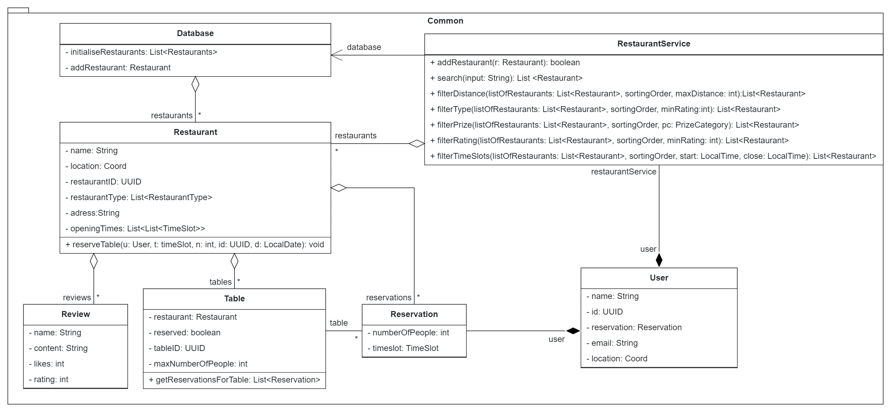
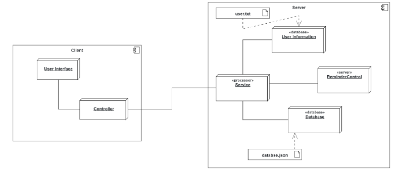

# Reservationsystem for restaurants

This is a Reservationsystem for restaurants made in a class at the TUM.

## Introduction

The reservation system consists of three parts. The model, the view, and the controller. The project
follows the classic scheme of mvc and uses the REST API for the communication.

## Design Goals
First, we prioritized the usability of the software, especially a system for restaurants needs to be
intuitive and easy to control, if not the restaurants are going to lose costumers and the software
would never be marketable. Since we prioritize the usability more lines of code are needed for a
better implementation of the restaurants. The rapid development of the software and the use of
newly learned skills caused the project to be uncomplete at some stages and not 100% bug-free.
## Subsystem decomposition
The Client subsystem is responsible for the UI integration and the connection with the REST API, it
also holds the database, which stores all restaurants with all their attributes. It also processes the
login and the user information. The user interface was created using JavaFX and fmxl files to layout
the structure of the window. Each section in the reservation process has its own controller, which
manages the data processing and saves the information if necessary to the server.
The common subsystem is the heart of the Software. Its subsystem model defines all important classes
and forms the base functionality of the system, and the user implements all important attributes for
the costumer.
The server subsystem is the backend and manages the resources and service for the communication
between the endpoint and the server. The server handles the reservations und the reminders to the
costumer.
## Hardware/software mapping

When opening the software, the controller builds the user interface and forms a connection to the
server, where all the information is being stored. With every click on the user interface, the
controller fetches all needed information form the server and display them on the user’s screen. At
the end of the reservation, the server stores the reservation to send out a reminder later.
## Persistent data management
To save the restaurant and every review to each restaurant, the software uses a json file and saves
each restaurant via its ID. Each object of the restaurant is being converted to a string and saved with
a specific id. To remove, edit or add a restaurant to the database you need access to the admin panel.
## Access control and security
Only an admin is allowed to connect to the database and change the inputs. He uses the login panel
and his credentials to access the dashboard. The password is saved in a text file, but encrypted via
SHA256, so no one can easily access the dashboard. As a user you need to input your information at
the beginning of opening the software, which are also getting stored in a text file without encryption.
The user only has limited access and only see which restaurants exists and place a reservation at one
of them. The reminders are getting send via a server as an email.
